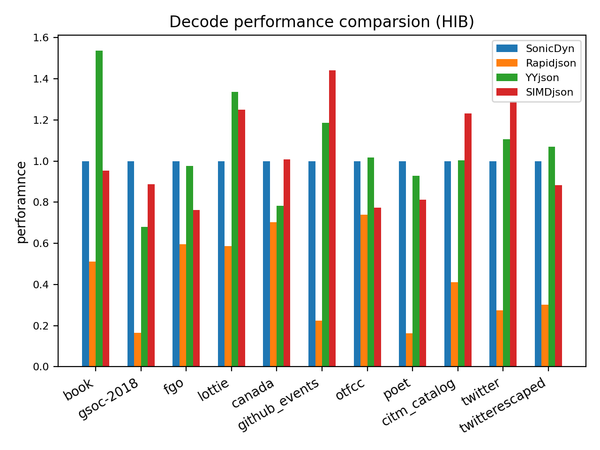
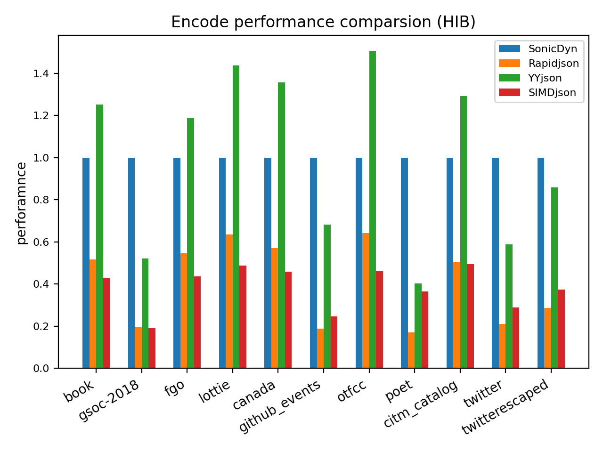
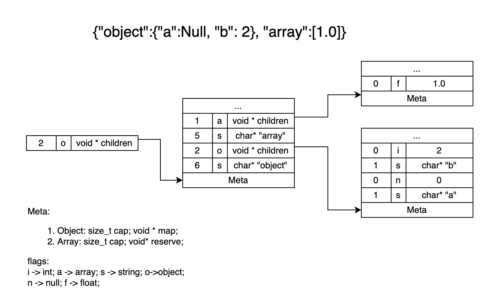

# Sonic-Cpp
----
A fast JSON serializing & deserializing library, accelerated by SIMD.

[](https://github.com/bytedance/sonic-cpp/actions/workflows/clang-format-check.yml)
[](https://github.com/bytedance/sonic-cpp/actions/workflows/test.yml)
[](https://codecov.io/gh/bytedance/sonic-cpp)

## Requirement
- c++11 or above
- x86 platform with AVX2 instruction
- GCC or LLVM compiler (not support MSVC compiler now)
- Linux OS

## Features
- Complete APIs for JSON value manipulation
- Fast on JSON serializing and parsing
- Support parse ondemand

## Benchmarks


- use CMake
```
cmake -S . -B build -DBUILD_BENCH=ON
cmake --build build --target bench -j
./build/benchmark/bench
```

- use bazel
```
bazel run :benchmark --compilation_mode=opt
```

### Performance by sonic benchmark

- Run

```shell
# build by bazel
python3 ./scripts/tools/draw-decode-encode.py
```
- Result

Parsing Performance


Serializing performance


### Performance by third-party benchmark

Below data is test by https://github.com/miloyip/nativejson-benchmark:

Parsing Performance


Serializing Performance


## API Document
Make sure Doxygen 1.8.13 or higher version has been installed. Then following:

```shell
mdkir api-doc && cd api-doc
doxygen ../Doxyfile
```

## Design

Sonic-cpp parses JSON into a compact document tree. The document structure is as follows:



There are many optimizations in parsing as follows:
- using SIMD to accelerate skipping white space.
- using SIMD to find escaped chars when parsing strings.
- using the STOA float pointing algorithm.

Sonic-cpp serializes a document to JSON. When serializing JSON strings, we should check the escaped characters first. So, we use SIMD instructions(AVX2/SSE) to find the escaped char for a long JSON string.

Sonic-cpp also supports ParseOnDemand if the user knows the target key at compile time. ParseOndemand also used SIMD and bit manipulation to skip the unwanted values fastly.

## Usage
### Include
Sonic-Cpp is a header-only library, you only need to include the directory of
Sonic-Cpp header files, such as adding `-I/path/to/sonic/include/` to your
compiler.

### Parsing and Serializing
```c++
#include "sonic/sonic.h"

#include <string>
#include <iostream>

int main()
{
  std::string json = R"(
    {
      "a": 1,
      "b": 2
    }
  )";

  sonic_json::Document doc;
  doc.Parse(json);

  sonic_json::WriteBuffer wb;
  doc.Serialize(wb);
  std::cout << wb.ToString() << std::endl;
}
// g++ -I./include/ -march=haswell --std=c++11 -O3 example/parse_and_serialize.cpp -o example/parse_and_serialize
```

### Checking parse result
```c++
#include "sonic/sonic.h"

#include <string>
#include <iostream>

int main()
{
  std::string json = R"(
    {
      "a": 1,
      "b": 2
    }
  )";

  sonic_json::Document doc;
  doc.Parse(json);
  if (doc.HasParseError()) {
    std::cout << "Parse failed!\n";
  } else {
    std::cout << "Parse successful!\n";
  }
  return 0;
}
// g++ -I./include/ -march=haswell --std=c++11 -O3 example/check_parse_result.cpp -o example/check_parse_result
```

#### Getting and Setting
```c++
#include "sonic/sonic.h"

#include <string>
#include <iostream>

using member_itr_type = typename sonic_json::Document::MemberIterator;

void print_member(member_itr_type m) {
  sonic_json::Node& key = m->name;
  sonic_json::Node& value = m->value;
  if (key.IsString()) {
    std::cout << "Key is: "
              << key.GetString()
              << std::endl;
  } else {
    std::cout << "Incorrect key type!\n";
    return;
  }
  if (value.IsInt64()) {
    std::cout << "Value is " << value.GetInt64() << std::endl;
  }

  return;
}

void set_new_value(member_itr_type m) {
  sonic_json::Node& value = m->value;
  value.SetInt64(2);
  return;
}

int main()
{
  std::string json = R"(
    {
      "a": 1,
      "b": 2
    }
  )";

  sonic_json::Document doc;
  doc.Parse(json);

  if (doc.HasParseError()) {
    std::cout << "Parse failed!\n";
    return -1;
  }

  // Find member by key
  if (!doc.IsObject()) { // Check JSON value type.
    std::cout << "Incorrect doc type!\n";
    return -1;
  }
  auto m = doc.FindMember("a");
  if (m != doc.MemberEnd()) {
    std::cout << "Before Setting new value:\n";
    print_member(m);
    std::cout << "After Setting value:\n";
    set_new_value(m);
    print_member(m);
  } else {
    std::cout << "Find key doesn't exist!\n";
  }
  return 0;
}
// g++ -I./include/ -march=haswell --std=c++11 -O3 example/get_and_set.cpp -o example/get_and_set
```
The following Is\*, Get\* and Set\* methods are supported:
- IsNull(), SetNull()
- IsBoo(), GetBool(), SetBool(bool)
- IsString(), GetString(), GetStringView(), SetString(const char*, size_t)
- IsNumber()
- IsArray(), SetArray()
- IsObject(), SetObject()
- IsTrue(), IsFalse()
- IsDouble(), GetDouble(), SetDouble(double)
- IsInt64(), GetInt64(), SetInt64(int64_t)
- IsUint64(), GetUint64(), SetUint64_t(uint64_t)

----
More [usage](docs/usage.md).

## RoadMap
* [ ] Support `RawNumber` for JSON parsing.
* [ ] Support [`JSON Path`](https://datatracker.ietf.org/wg/jsonpath/about/).
* [ ] Support [`JSON Merge Patch`](https://www.rfc-editor.org/rfc/rfc7396).
* [ ] Support [`JSON Pointer`](https://datatracker.ietf.org/doc/html/rfc6901).
* [ ] Support more platforms, e.g. ARM.
* [ ] Support struct bind.
* [ ] Support validating UTF-8.

## Contributing
Please read [CONTRIBUTING.md](CONTRIBUTING.md) for information on contributing to sonic-cpp.

